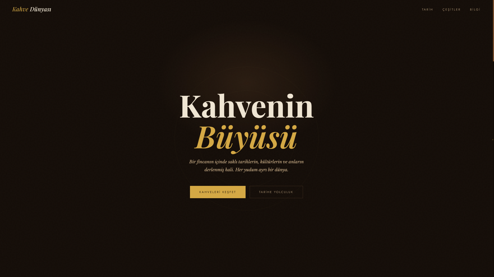

# Kahve Dünyası

<div align="center">

**Kahve kültürünü, tarihini ve çeşitlerini tanıtan tam kapsamlı bir web deneyimi.**

[](https://developer.mozilla.org/en-US/docs/Web/HTML)
[](https://developer.mozilla.org/en-US/docs/Web/CSS)
[](https://developer.mozilla.org/en-US/docs/Web/JavaScript)
[](https://pages.github.com)

[Canlı Demo](https://mustafaaklar.github.io/kahve-dunyasi) · [Hata Bildir](https://github.com/kullanici-adin/kahve-dunyasi/issues) · [Öneri Sun](https://github.com/kullanici-adin/kahve-dunyasi/issues)

</div>

---

## Proje Hakkında

Kahve Dünyası, sıfırdan yazılmış bir frontend projesidir. Herhangi bir framework ya da kütüphane kullanılmadan yalnızca **HTML, CSS ve Vanilla JavaScript** ile geliştirilmiştir.

Projenin amacı; modern web tasarım prensiplerini, CSS animasyonlarını ve DOM manipülasyonunu gerçek bir içerik sitesi üzerinde pratiğe dökmekti. Kahve teması, görsel açıdan zengin bir içerik sunma fırsatı verdiği için seçildi.

---

## Özellikler

| Özellik | Açıklama |
|---|---|
| 🎞️ Animasyonlu hero | Yayılan halka efektleri ve CSS keyframe animasyonları |
| 📸 Fotoğraflı kahve kartları | 16 kahve çeşidi gerçek fotoğraf ve açıklamalarla |
| 🗂️ Sekmeli kategoriler | JS ile dinamik sekme geçişleri |
| 📊 Yoğunluk göstergesi | Her kahveye özel animasyonlu güç çubuğu |
| 🖱️ Özel imleç | `mix-blend-mode` ile altın renkli özel fare imleci |
| 🎢 Akan yazı şeridi | CSS `animation` ile sonsuz döngülü marquee |
| 🔢 Sayaç animasyonu | IntersectionObserver ile scroll tetiklemeli sayaç |
| 👁️ Scroll açılmaları | Sayfa kaydırıldıkça elemanların yukarıdan çıkması |
| 📱 Responsive tasarım | Mobil, tablet ve masaüstü uyumlu |
| 🌙 Koyu tema | Kahverengi, krem ve altın renk paleti |

---

## Ekran Görüntüleri

> 

    (resimler/ScreenShot-1.png)

---

## Teknolojiler


- **HTML5** — Semantik yapı, erişilebilirlik
- **CSS3** — Grid, Flexbox, Custom Properties, Keyframe animasyonlar
- **Vanilla JavaScript** — DOM manipülasyonu, olay dinleyicileri, animasyon mantığı
- **Google Fonts** — Playfair Display, Libre Baskerville, Jost

---

## Dosya Yapısı

```
kahve-dunyasi/
│
├── index.html          
├── style.css           
├── script.js         
├── README.md
│
└── resimler/        
    ├── etiyopya.jpg
    ├── espresso.jpg
    ├── ristretto.jpg
    ├── americano.jpg
    ├── turk-kahvesi.jpg
    ├── pour-over.jpg
    ├── french-press.jpg
    ├── latte.jpg
    ├── cappuccino.jpg
    ├── mocha.jpg
    ├── flat-white.jpg
    ├── cold-brew.jpg
    ├── iced-latte.jpg
    ├── frappe.jpg
    ├── affogato.jpg
    ├── egg-coffee.jpg
    └── filter-coffee.jpg
```

---

## Bu Projeden Öğrendiklerim

Bu proje benim için bir öğrenme süreciydi. Daha önce teorik olarak bildiğim pek çok konuyu ilk kez gerçek bir proje üzerinde uyguladım.

### CSS Animasyonları ve Keyframe

Daha önce animasyonları çok yüzeysel kullanıyordum. Bu projede `@keyframes`, `animation-delay` ve `animation-fill-mode` gibi özellikleri birlikte kullanarak giriş bölümündeki halka efektini ve akan yazı şeridini sıfırdan yazdım. Animasyonların birbiriyle nasıl senkron çalışması gerektiğini kavradım.

### IntersectionObserver API

Scroll ile tetiklenen açılma animasyonları için `IntersectionObserver` kullandım. Bu API sayesinde sayfa kaydırıldıkça elemanların ekrana girmesini algılayıp CSS class ekleyebildim. `setTimeout` ile gecikme ekleyerek kartların birbiri ardına gelmesini sağladım.

### CSS Custom Properties (Değişkenler)

Tüm renkleri, yazı tiplerini ve tekrar eden değerleri `:root` içinde CSS değişkeni olarak tanımladım. Bu sayede temayı tek bir yerden yönetmek çok kolaylaştı ve kodun okunabilirliği arttı.

### CSS Grid ve Flexbox Birlikte Kullanımı

Sayfa düzenini oluştururken Grid ve Flexbox'ı hangi durumda kullanmam gerektiğini öğrendim. Genel sayfa iskeletinde Grid, navigasyon ve buton gruplarında ise Flexbox tercih ettim.

### DOM Manipülasyonu

Sekme sistemi tamamen JavaScript ile yazıldı. `querySelector`, `classList`, `dataset`, `forEach` gibi metodları gerçek bir ihtiyaç doğrultusunda kullandım. Teoride bildiğim bu metodları pratikte uygulamak çok farklıydı.

### Sayaç Animasyonu Algoritması

Rakam sayaçları için `requestAnimationFrame` ve kolaylaştırıcı (easing) fonksiyon yazdım. Zamanı hesaplayarak rakamın yavaşlayarak hedefe ulaşmasını sağladım. Bu küçük detay kullanıcı deneyimini belirgin şekilde iyileştirdi.

---

## Lisans

MIT © 2026 [Mustafa Aklar](https://github.com/mustafaaklar)
