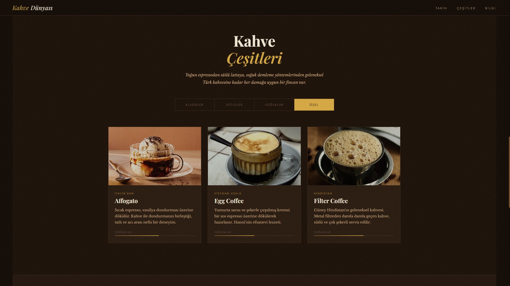

# ☕ Kahve Dünyası

<div align="center">

### Kahve kültürünü, tarihini ve çeşitlerini modern bir arayüz ile sunan etkileşimli web deneyimi

[](https://developer.mozilla.org/en-US/docs/Web/HTML)
[](https://developer.mozilla.org/en-US/docs/Web/CSS)
[](https://developer.mozilla.org/en-US/docs/Web/JavaScript)
[](https://pages.github.com)

### 🌐 [Canlı Demo](https://mustafaaklar.github.io/Coffe-web)

</div>

---

## 📖 Proje Hakkında

Kahve Dünyası, yalnızca **HTML5, CSS3 ve Vanilla JavaScript** kullanılarak sıfırdan geliştirilmiş modern bir frontend projesidir.

Bu proje, gerçek bir içerik sitesi üzerinden modern web geliştirme tekniklerini uygulamak, kullanıcı deneyimi odaklı arayüzler oluşturmak ve performanslı animasyon sistemleri geliştirmek amacıyla hazırlanmıştır.

Herhangi bir framework kullanılmadan, tamamen saf web teknolojileri ile oluşturulmuştur.

---

## ✨ Öne Çıkan Özellikler

| Özellik                            | Açıklama                                    |
| ---------------------------------- | ------------------------------------------- |
| 🎞️ Animasyonlu giriş bölümü       | CSS keyframe tabanlı özel animasyon sistemi |
| ☕ Kahve çeşitleri sistemi          | 16 farklı kahve türü ve detaylı içerik      |
| 🎯 Scroll tetiklemeli animasyonlar | IntersectionObserver API kullanımı          |
| 🔢 Animasyonlu sayaç sistemi       | requestAnimationFrame tabanlı akıcı sayaç   |
| 🖱️ Özel imleç efekti              | Modern blend-mode kullanımı                 |
| 🎢 Sonsuz kayan yazı               | Saf CSS animation ile performanslı marquee  |
| 📱 Tam responsive tasarım          | Mobil, tablet ve masaüstü uyumlu            |
| 🎨 Modern UI tasarımı              | Kahve temalı profesyonel renk paleti        |

---

## 🖼️ Ekran Görüntüsü




---

## 🧠 Kullanılan Teknolojiler

* **HTML5** — Semantik ve erişilebilir yapı
* **CSS3** — Grid, Flexbox, Animasyonlar, Custom Properties
* **JavaScript (Vanilla JS)** — DOM manipülasyonu ve animasyon kontrolü
* **Google Fonts** — Modern tipografi sistemi

---

## 📁 Proje Yapısı

```
Coffe-web/
│
├── index.html
├── style.css
├── script.js
├── README.md
│
└── resimler/
    ├── espresso.jpg
    ├── latte.jpg
    ├── cappuccino.jpg
    └── ...
```

---

## 🚀 Öğrenilen ve Uygulanan Konular

Bu proje kapsamında aşağıdaki modern web geliştirme konuları pratik edilmiştir:

* CSS Animasyon Sistemleri
* IntersectionObserver API kullanımı
* DOM Manipülasyonu
* Responsive Design prensipleri
* requestAnimationFrame ile animasyon kontrolü
* CSS Grid ve Flexbox birlikte kullanımı
* Modern UI/UX tasarım prensipleri

---

## 🌐 Canlı Kullanım

Projeyi canlı olarak görüntülemek için:

**https://mustafaaklar.github.io/Coffe-web**

---

## 👨‍💻 Geliştirici

**Mustafa Aklar**

GitHub:
https://github.com/mustafaaklar

---

## 📄 Lisans

Bu proje MIT lisansı ile lisanslanmıştır.

Portföy ve eğitim amaçlı kullanılabilir.
